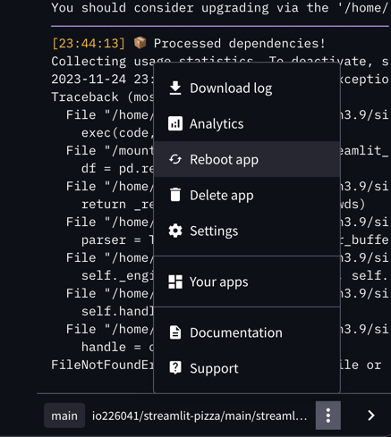
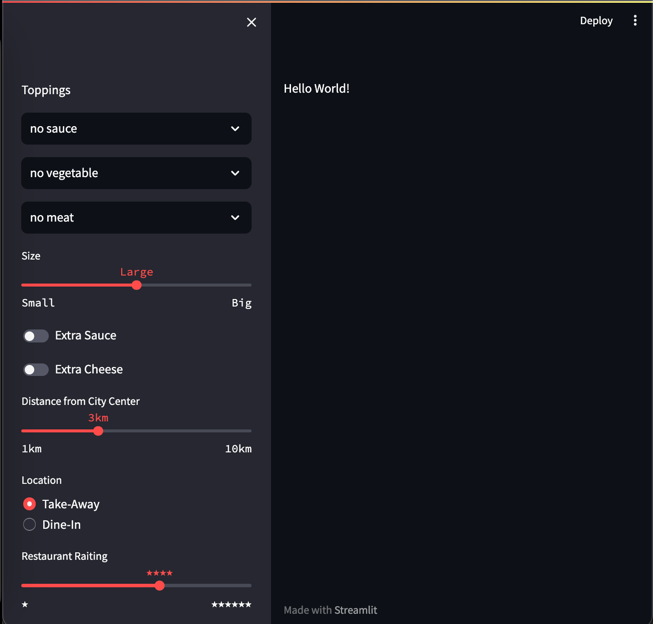

# Tutorial

## Streamlit einrichten

Unter folgendem Link finden Sie eine Einleitung, wie die Streamlit eingerichtet und eine App erstellt und über GitHub eingerichtet werden kann.   
https://youtu.be/HKoOBiAaHGg

Folgen Sie der Anleitung und erstellen Sie ihre eigene App.

## Python Bibliotheken installieren
Damit der Server, auf welchem die Streamlit-App läuft, alle benötigten Bibliotheken installieren kann, muss die Liste dieser Bibliotheken dem App-Projekt hinzugefügt werden. Erstellen Sie dafür eine neue Datei `requirements.txt` neben der `streamlit.py`-Datei mit foldendem Inhalt:
```properties
pandas~=2.1.3
scikit-learn~=1.3.2
statsmodels~=0.14.0
```
Committen Sie die Änderungen.
Damit die in `requirements.txt` angegebenen Python-Bibliotheken auf dem App-Server installiert werden, muss die App neugestartet werden. Neustart kann durch "Manage app" -> "Reboot app" initiiert werden:



## Pizza-Daten Datei einfügen

Für die Erstellung des KI-Modells werden die Test- und Trainings-Daten benötigt.
Legen Sie folgende Datei in Ihr App-Projekt neben der `streamlit.py`-Datei ab: 

[pizza_dataset_relative_price.csv](pizza_dataset_relative_price.csv)

## Model estellen

Mit folgendem Python Code wird das Modell erstellt.

```python
import pandas as pd
from sklearn.model_selection import train_test_split
from statsmodels import api as sm

csv_file="pizza_dataset_relative_price.csv"
df = pd.read_csv(csv_file)
Y = df['Relative Price']
X = df.drop(['Relative Price', 'Pizza Name', 'Topping 3_Meat', 'Topping 3_None', 'Topping 4_Fish', 'Topping 4_None',
             'Overall Weight'], axis=1) 
X = sm.add_constant(X)
X_train, X_test, y_train, y_test = train_test_split(X, Y, test_size=0.30, random_state=1)
model = sm.OLS(y_train, X_train).fit()
print("model created")
```
Die Zusammenfassung des Modells wird mithilfe von `model.summary()` ausgegeben.
```python
print(model.summary())
```

Die Erstellung des Modells wird in eine separate Funktion ausgelagert. Die Auslagerung der Modellerstellung in eine separate Funktion ermöglicht eine verbesserte Code-Struktur, einfachere Wartbarkeit und erhöhte Wiederverwendbarkeit.  
Als Funktionseingabeparameter wird die csv-Datei mit den Daten reingereicht.
```python

import pandas as pd
from sklearn.model_selection import train_test_split
from statsmodels import api as sm

def create_model(csv_file):
    df = pd.read_csv(csv_file)
    Y = df['Relative Price']
    X = df.drop(['Relative Price', 'Pizza Name', 'Topping 3_Meat', 'Topping 3_None', 'Topping 4_Fish', 'Topping 4_None',
                 'Overall Weight'], axis=1) 
    X = sm.add_constant(X)
    X_train, X_test, y_train, y_test = train_test_split(X, Y, test_size=0.30, random_state=1)
    model = sm.OLS(y_train, X_train).fit()
    print("model created")
    return model
```
Nun kann die Funktion aufgerufen werden. Hier im Beispiel liegt die csv-Datei im data-Verzeichnis.
Die Zusammenfassung des Modells wird mithilfe von `model.summary()` ausgegeben.

```python
model = create_model(csv_file="data/pizza_dataset_relative_price.csv")
print(model.summary())
```

## Pizzapreis mithilfe des Modells vorhersagen

Nur können wir mit einem Beispiel-Datensatz den Preis einer Pizza vorhersagen. Der Datensatz soll genau die Spalten erhalten, welche im Modell vorhanden sind.
```python
pizza_data_record = {
    'Intercept': 2,                     #
    'Topping 1': 0,                     # 0: no, 1: yes
    'Topping 2': 1,                     # 0: no, 1: yes
    'Topping 3': 0,                     # 0: no, 1: yes
    'Size': 1,                          # 0: Small, 1: Large, 2: Big
    'Extras Sauce': 1,                  # 0: no, 1: yes
    'Extra Cheese': 0,                  # 0: no, 1: yes
    'Distance to City Center (km)': 3,  # 1,3,5,10 km
    'Restaurant': 0,                    # 0: Take-Away, 1: Dine-In
    'Rating': 4                         # 1,2,3,4,5,6 Stars
}

df = pd.DataFrame([pizza_data_record])
print(df)
print(df.transpose())

predicted_price = model.predict(df)
print(f"Predicted Price for the User's Pizza: {predicted_price.values[0]}")
```
Hier wird ebenfalls der predict-Code in eine Funktion ausgelagert.
Als Eingabeparameter bekommt die Funktion den Testdatensatz und das Modell selbst.
```python
def predict_price(pizza_data_record, model):
    df = pd.DataFrame([pizza_data_record])
    print(df)
    print(df.transpose())
    predicted_price = model.predict(df)
    print(f"Predicted Price for the User's Pizza: {predicted_price.values[0]}")
    return predicted_price.values[0]


pizza_data_record = {
    'Intercept': 2,                     #
    'Topping 1': 0,                     # 0: no, 1: yes
    'Topping 2': 1,                     # 0: no, 1: yes
    'Topping 3': 0,                     # 0: no, 1: yes
    'Size': 1,                          # 0: Small, 1: Large, 2: Big
    'Extras Sauce': 1,                  # 0: no, 1: yes
    'Extra Cheese': 0,                  # 0: no, 1: yes
    'Distance to City Center (km)': 3,  # 1,3,5,10 km
    'Restaurant': 0,                    # 0: Take-Away, 1: Dine-In
    'Rating': 4                         # 1,2,3,4,5,6 Stars
}

price = predict_price(pizza_data_record, model)
print(f"price: {price} €")
```

Gesamter Code bis jetzt: 
```python
import pandas as pd
from sklearn.model_selection import train_test_split
from statsmodels import api as sm


def create_model(csv_file):
    df = pd.read_csv(csv_file)
    Y = df['Relative Price']
    X = df.drop(['Relative Price', 'Pizza Name', 'Topping 3_Meat', 'Topping 3_None', 'Topping 4_Fish', 'Topping 4_None',
                 'Overall Weight'], axis=1)
    X = sm.add_constant(X)
    X_train, X_test, y_train, y_test = train_test_split(X, Y, test_size=0.30, random_state=1)
    model = sm.OLS(y_train, X_train).fit()
    print("model created")
    return model


def predict_price(pizza_data_record, model):
    df = pd.DataFrame([pizza_data_record])
    print(df)
    print(df.transpose())
    predicted_price = model.predict(df)
    print(f"Predicted Price for the User's Pizza: {predicted_price.values[0]}")
    return predicted_price.values[0]


pizza_data_record = {
    'Intercept': 2,                     #
    'Topping 1': 0,                     # 0: no, 1: yes
    'Topping 2': 1,                     # 0: no, 1: yes
    'Topping 3': 0,                     # 0: no, 1: yes
    'Size': 1,                          # 0: Small, 1: Large, 2: Big
    'Extras Sauce': 1,                  # 0: no, 1: yes
    'Extra Cheese': 0,                  # 0: no, 1: yes
    'Distance to City Center (km)': 3,  # 1,3,5,10 km
    'Restaurant': 0,                    # 0: Take-Away, 1: Dine-In
    'Rating': 4                         # 1,2,3,4,5,6 Stars
}

# create model
model = create_model(csv_file="data/pizza_dataset_relative_price.csv")
print(model.summary())

# predict price
price = predict_price(pizza_data_record, model)
print(f"price: {price} €")
```

## Dateneingabe über die Sidebar

Estellen Sie nun die Oberflächenelemente in der App, damit ein Test-Record eingegeben werden kann. Für die Eingabe eignet sich die Sidebar. 
```python
st.sidebar.write("Toppings")
topping1 = st.sidebar.selectbox(label=f"#1 - sauce", options=(["no sauce", "Tomato Sauce", "Pesto", "Alfredo"]), label_visibility="collapsed")
topping2 = st.sidebar.selectbox(label=f"#2 - vegetable", options=(["no vegetable", "Pepperoni", "Mushrooms", "Onions", "Tomatoes"]), label_visibility="collapsed")
topping3 = st.sidebar.selectbox(label=f"#3 - meat", options=(["no meat", "Sausage", "Bacon", "Gyros"]), label_visibility="collapsed")
size_labels = {0: "Small", 1: "Large", 2: "Big"}
pizza_size = st.sidebar.select_slider("Size", [0, 1, 2], 1, format_func=lambda x: size_labels[x])
extra_sauce = st.sidebar.toggle("Extra Sauce")
extra_cheese = st.sidebar.toggle("Extra Cheese")
distance = st.sidebar.select_slider("Distance from City Center", [1, 3, 5, 10], 3, format_func=lambda x: f"{x}km")
location_labels = {0: "Take-Away", 1: "Dine-In"}
location_choice = st.sidebar.radio("Location", [0, 1], format_func=lambda x: location_labels[x])
rating = st.sidebar.select_slider("Restaurant Raiting", [1, 2, 3, 4, 5, 6], 4, format_func=lambda x: f"{x * '★'}")
```

Die App soll nun wie folgt im Browser aussehen:

